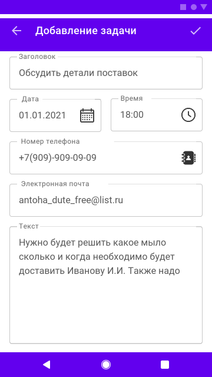
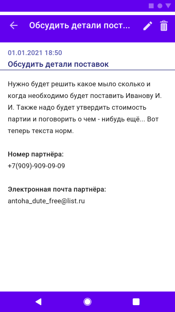

# Android多功能日记本

## 项目概述

本项目需要实现一个功能实用且齐全的日记本，界面友好，使用便捷。

系统主要示例功能如下（*为选做，），可以自由扩展或修改相关功能：

1. 添加、修改、删除和查询日记，在日记中添加图片、天气和定位 ；
2. *日记内容支持富文本；
3. *自定义系统的主题样式；
4. 添加和修改访问密码锁 ；
5. 允许改变日记的排列顺序；
6. 支持导入和导出常见类型的数据文件 ；
7. *自动保存日记编辑内容。

## 开发环境

IDE: Android Studio

编程语言：Java ( JDK17 )

## 学习要求

1. 使用SQLite数据库存储数据，可搭配GreenDao数据库框架。
2. 架构无要求 (无架构、MVC 、MVP、MVVM、MVI均可，推荐使用MVVM)。

## 提示

工具库推荐：

1. 序列化工具：Gson
2. 网络请求框架：Okhttp
3. 图片加载框架：Glide
4. 权限请求框架：XXPermissions
5. SQLite数据库框架：GreenDAO

## 参考UI

该部分内容仅供参考，请根据具体功能设计修改。

|  |  |  |
| ----------------------------------- | ----------------------------------- | ----------------------------------- |

## 版权声明

所有资源均遵循「知识共享 - 署名 4.0」协议

```
You are free to:
Share — copy and redistribute the material in any medium or format for any purpose, even commercially.
Adapt — remix, transform, and build upon the material for any purpose, even commercially.
The licensor cannot revoke these freedoms as long as you follow the license terms.
Under the following terms:
Attribution — You must give appropriate credit , provide a link to the license, and indicate if changes were made . You may do so in any reasonable manner, but not in any way that suggests the licensor endorses you or your use.
No additional restrictions — You may not apply legal terms or technological measures that legally restrict others from doing anything the license permits.
Notices:
You do not have to comply with the license for elements of the material in the public domain or where your use is permitted by an applicable exception or limitation .

No warranties are given. The license may not give you all of the permissions necessary for your intended use. For example, other rights such as publicity, privacy, or moral rights may limit how you use the material.
```

部分资源源链接：

- [记事本界面设计-MasterGo 社区](https://mastergo.com/community/resource/7018?from=card)